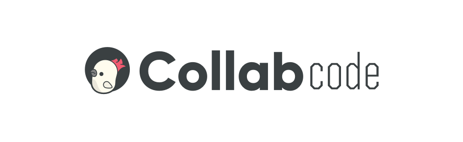

# CollabCode Training

An Open Source online course platform. It's the FrontEnd that use React.

## Getting Started

1. Fork this repo and clone in your machine;

2. Change directory to `training-frontend` where you cloned it:

```bash
git clone https://github.com/CollabCodeTech/training-frontend
```

3. At the terminal, run:

```bash
cd training-frontend
npm i
cp .env.example .env
docker-compose up -d
```

4. Open up [localhost:3000](http://localhost:3000) and start using it

### Prerequisites

- Npm
- Node (>=12.16.1)
- Docker
- Docker compose

## Running the tests when you are developing

```bash
npm run cy:open
```

## Running all tests

```bash
npm test
```

## Built With

- [ReactJS](http://reactjs.org)

## Contributing

Please read [CONTRIBUTING.md](CONTRIBUTING.md) for details on our code of conduct, and the process for submitting pull requests to us.

## Authors

- **Joviane Jardim** - [@joviane](https://twitter.com/jovianejardim)
- **Marco Bruno** - [@marcobrunobr](https://twitter.com/marcobrunobr)

See also the list of [contributors](https://github.com/CollabCodeTech/training-frontend/contributors) who participated in this project.

## License

This project is licensed under the MPL 2.0 License - see the [LICENSE](LICENSE.md) file for details

## Acknowledgments

Thanks to all members of CollabCode's community for the support! We love you!

## Next Releases

- [ ] One course and video player (**15 March 2020**) _ashe_
- [ ] Panel to other person that we will invite to send courses (**15 May 2020**) _aphelios_
- [ ] Open panel to community to send courses (**15 July 2020**) _anivia_

## Questions

- [Discord CollabCode](http://bit.ly/discord-collabcode)
